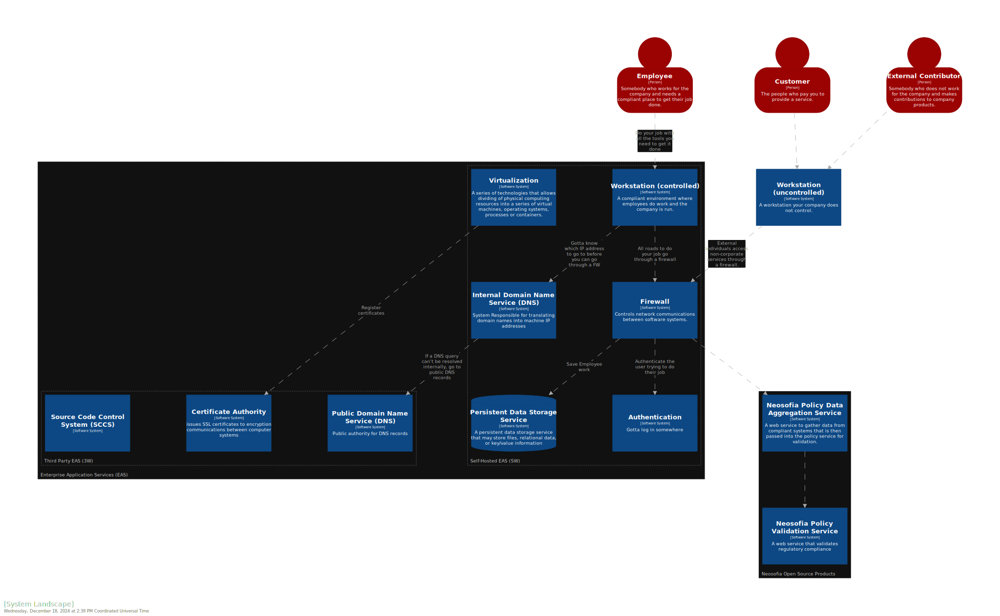
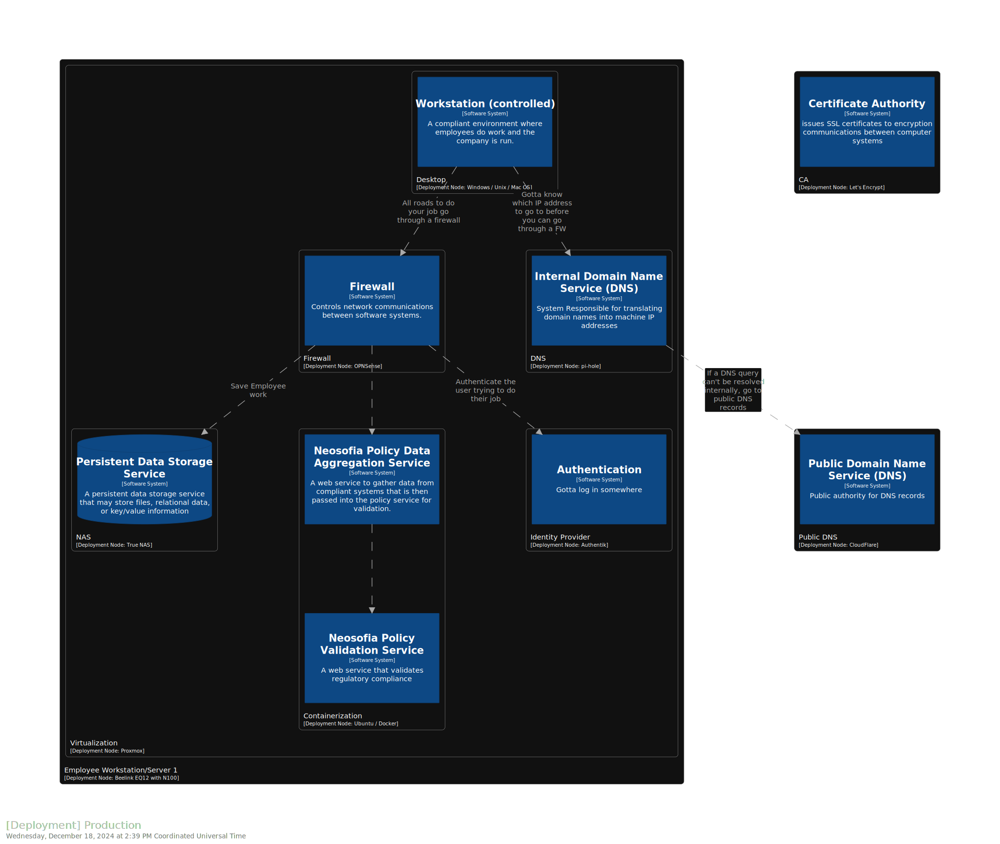

# Neosofia Glossary and Architecture

## What is Compliance?

What would the world be like if there were no regulations or polices? Or put another way, what if there was nothing to comply with? Would we live in a world packed with snake oil vendors pedaling whatever wares possible to consumers despite their safety and efficacy? A world where technology companies use every scrap of information without our consent to push whatever products the highest marketing bidder can pay for? A world where the risk of being harmed while driving or taking public transit is a function of how much safety you can afford to pay for?

[^credit]

Compliance is done to conform with regulations, polices, and standards, but the desired end result is a world where every human, regardless of their ability to pay, is 1) safe from harm 2) has a right to their privacy and 3) has the right to choose how they live their lives without infringing on 1 or 2 for anybody else.

When I hear compliance I think:
 * How can I make technology systems *secure* to protect each person's right to privacy
 * How can I produce a *safe and effective* product

When a "moral" company hears compliance, they think:
 * How can I minimize my IT expenses to comply with all the regulations applicable to us and protect my IP
 * How can I produce a safe and effective product for the lowest cost while remaining compliant

Amoral companies don't think about compliance. They view it as obstacle to selling more products with the highest margin possible without considering the implications. (Thermo Phisher reference and other references)

This series of posts will blend the more human desire to provide a safe, effective, and secure product/service with the "moral" companies desire to comply with regulations at the lowest cost possible. When you see compliance -- think safe, effective, secure, and cost-efficient.

## Compliance from the Top

Policy: A rule created by an organization to achieve their goals.
Regulation: A policy that must be complied with and has fines/sanctions.
Procedures: steps taken to achieve something
Standard Operating Procedure (SOP): An approved set of steps to achieve an outcome. In addition to procedures, SOPs will also include entry/exit criteria, assigned roles, responsibilities, purpose, scope/limitation and SLOs for determining How Who does What and When.
Evidence: proof that a policy or procedure is being followed
Validation: Evaluation of evidence to determine if it is accurate and reliable. 
Audit: Validation of a system (set of evidence) 

### System Backup and Recovery Example 

#### Policy

Neosofia will define and maintain system backup and recovery SOPs to protect client data from loss, unintended manipulation, and improper data residency.

#### Related Regulations
 * GDPR Article 32
 * NIST SP 800-53 Section 3.6 Contingency Planning
 * Many many many more!

#### SOP
 [IT-245-System Backup and Recovery.md](tbd)

#### Evidence
 [link to policy validation service output](tbd)

The not so secret sauce will lie in the policy validation service output as that will tie our evidence of compliance into all the regulations that require it. Neosofia has also elected to make this information public and has fully automated the backup and restoration test procedures so that evidence is continually generated whenever the implementation changes.

As an organization we're on a mission to help any company of any size improve their compliance and this is why we've elected to make all of our polices, procedures, roles, glossary, evidence, design, and implementation public facing. Most organizations today store this information in a private corporate data store and make evidence available for "on-site" review to protect their IP. As this repository is open source, you're free to use any content as you like. Our only (legally non-binding) request is that you cite [Neosofia](https://github.com/neosofia/corporate) in any public facing "thanks" or "powered by" section of your website should you use any of the content here. Our team is available for consulting work, and you can sponsor this project if you want to see specific topics covered.

### Onboarding Example

#### Policy

Neosofia will define and maintain onbaording SOPs to ensure new hires have access to the systems they need to do their job and are qualified for the roles they will fulfill.

## Glossary

“A mistake is to commit a misunderstanding.”
-Bob Dylan

To minimize the chance of mistakes, our [glossary](../../shared/glossary.md) will include the terminology we wish to standardize to create a shared context for all. To emphasize used glossary terms, we will always link to the glossary when a defined phrase is presented and use the commonly accepted abbreviation.

## Architecture

At the foundation of any compliant [EAS](../../shared/glossary.md#EAS) lies a set of system architecture diagrams that defines how technology systems and system users interact with each other. To express these relationships, Neosofia has elected to adopt the C4 model and more specifically Structurizr to generate all architecture diagrams. 

The initial set of [EASs](../../shared/glossary.md#EAS) documented will include all the hardware and software needed to operate a minimally compliant technology organization including:
 * A Beelink EQ12 with N100 processor for the service defined below.
 * Proxmox for the host [OS](../../shared/glossary.md#OS)
 * Cloudflare for public [DNS](../../shared/glossary.md#DNS)
 * Let's Encrypt for [SSL](../../shared/glossary.md#SSL) certificates
 * Github for [SCCS](../../shared/glossary.md#SCCS)
 * piHole for internal [DNS](../../shared/glossary.md#DNS) and basic malware protection

And the initial set of compliance checks provided by our compliance service will include
 * Encryption in flight
 * Basic malware (sinkhole) protection via DNS
 * System Backup and recovery procedures

Our first end state will be a set of systems that are destroyed and programmatically rebuilt once per day. We rebuild daily to act as a forcing function that tests our backup and recovery procedures -- a foundational piece for any compliant system. 

 Most organizations run their compliance checks on a quarterly or yearly basis, which can quickly lead to a degradation of compliance or security. To avoid this drift in system state vs security/compliance, all Neosofia compliance checks will be run on a daily basis after the system restoration test. We will also (whenever possible) declaratively manage resources and validate system changes before deployment into a production environment.

To better understand the systems we'll first be working with, two C4 diagrams were created to better visualize our starting point. The first architecture diagram is a system landscape diagram that shows the role of each software system and how it relates to others systems and users. 

Our second diagram show how systems are deployed from a physical and logical point of view with a description of the technologies used to provide the service in question.

## What's Next?

The [next post](1000_system_backup_and_recovery.md) in our series will go into more detail on our system backup and recover procedures that will become part of our broader business continuity plan.

## Deeper Dive

For interactive architecture diagrams that allow you to change the layout, zoom in/out of the various components, filter based on tags, and/or reveal regulatory perspectives for each system clone this repo and follow the instructions in the [architecture README](../../architecture/README.md)

To reproduce this setup, follow the instructions in the [Proxmox README](../../os/proxmox/README.md) setup guide. Upon finishing the guide, you should have fully functioning virtualization environment with backup and recovery procedures in place.

## Credits

[^credit]: created using "DALL•E 3 XL v2" on Huggingface with the prompt "flintstones car driven by a frantic looking person" seed: 1059621461 no negative prompts